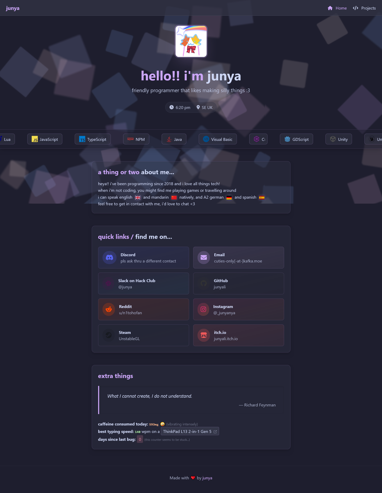

# junyali.github.io

A redesign of my personal website built with Vite and Tailwind CSS with Catppuccin colours :3



## Overview / What's new

This is still a static website that serves as my personal website. There isn't really anything special but...

- Cooler design
- Dedicated page to show my projects :p
- Better background effects
- RIP your browser performance because of how resource hungry this website is
- Tried using Tailwind CSS for most of styling and doing html elements in Typescript

## How to build

### Prerequisites

- Node.js (v20 LTS)
- npm

### Setup

```bash
$ git clone https://github.com/junyali/junyali.github.io.git
$ cd junyali.github.io
$ npm install
$ npm run dev
# Should run at localhost:5173
```