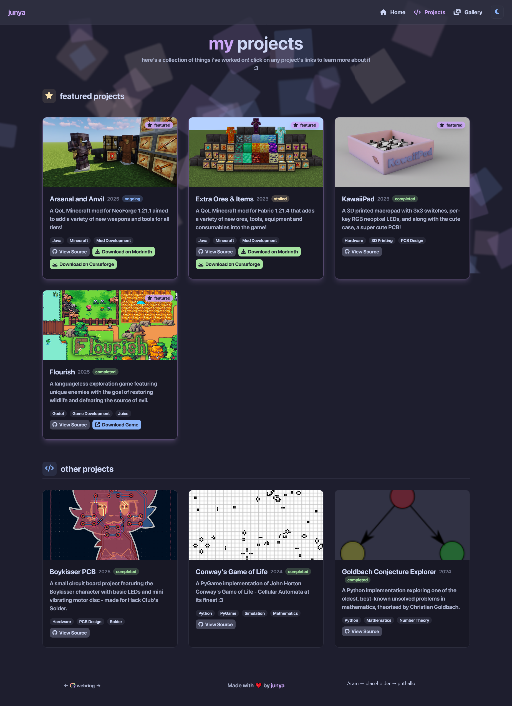
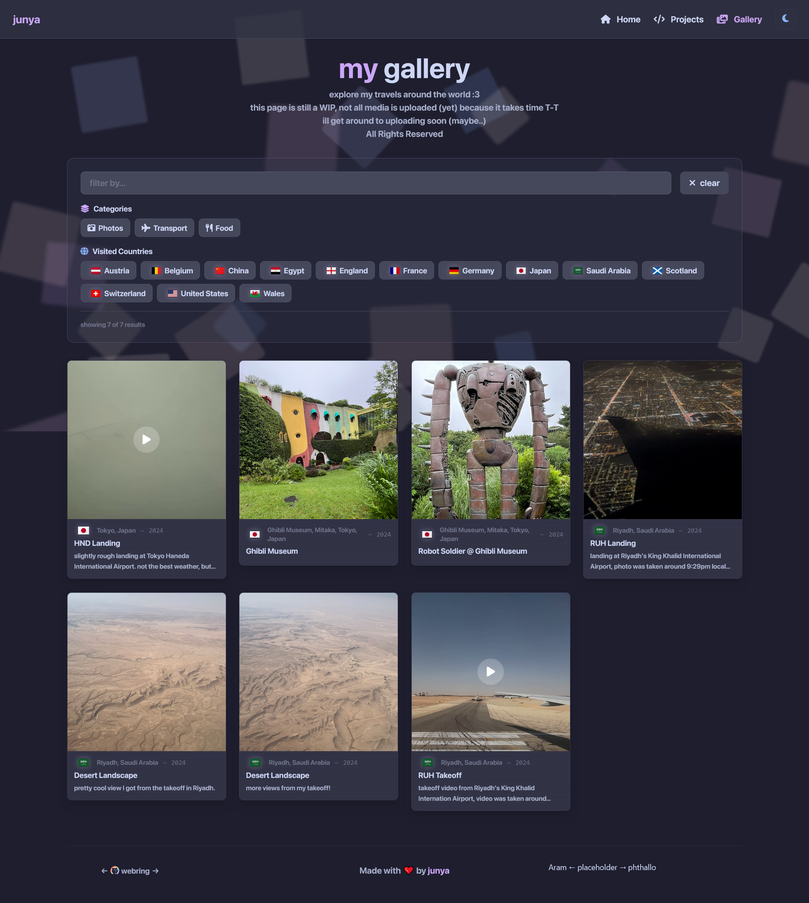

# junyali.github.io

A redesign of my personal website built with Vite and Tailwind CSS with Catppuccin colours :3


## Overview / What's new in the redesign

This is still a static website that serves as my personal website. There isn't really anything special but...

- Cooler design (catppuccin colour scheme, now with light mode switch!)
- Dedicated page to show my projects :p
- Better background effects
- RIP your browser performance because of how resource hungry this website is
- Tried using Tailwind CSS for most of styling and doing html elements in Typescript
- Redesigned gallery page from ground-up and used a CDN to host media
- There is also an easter egg 🐰🥚 - can you find it? (it has multiple outcomes :eyes:)

- 



## How to build

### Prerequisites

- Node.js (v20 LTS)
- npm

### Setup

```bash
$ git clone https://github.com/junyali/junyali.github.io.git
$ cd junyali.github.io
$ npm install
$ npm run dev
# Should run at localhost:5173
```

## Licensing

Except for media available on the gallery page, which is licensed under All Rights Reserved, website source code is licensed under MIT.
